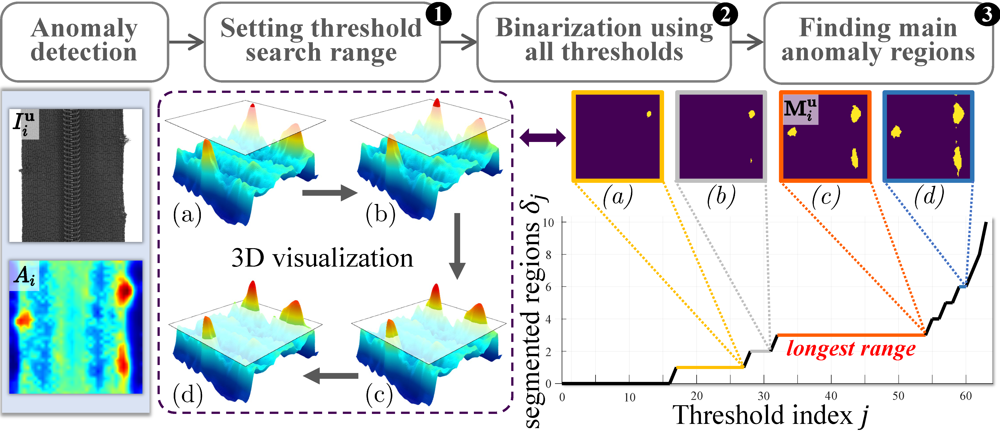
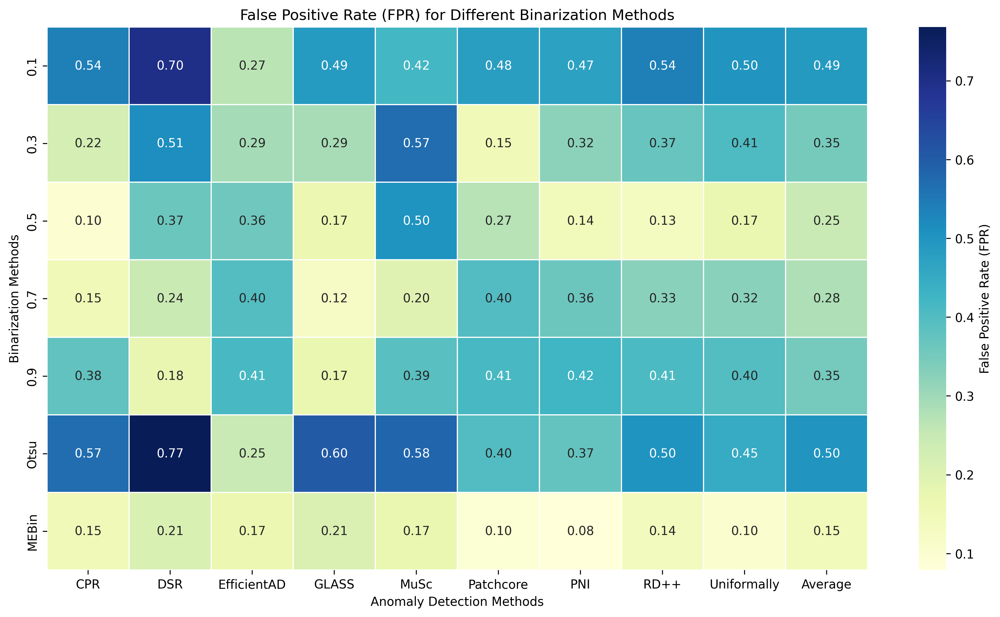
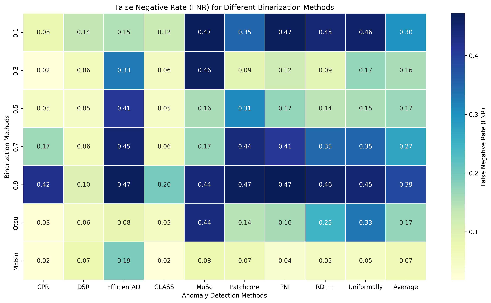
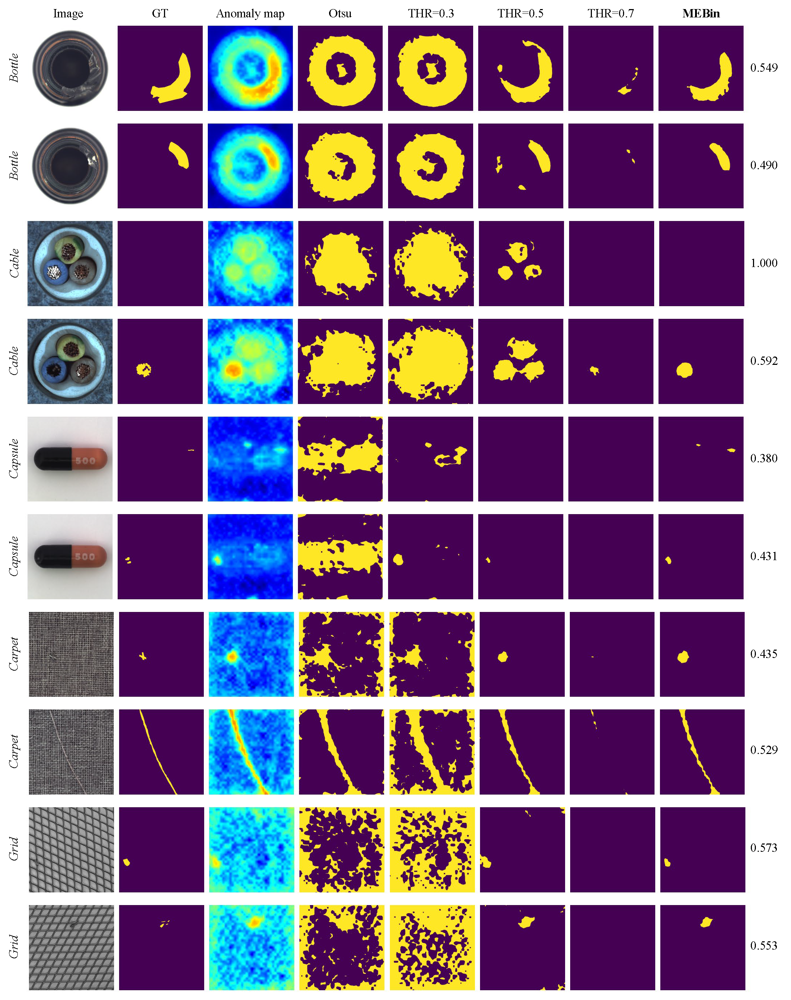
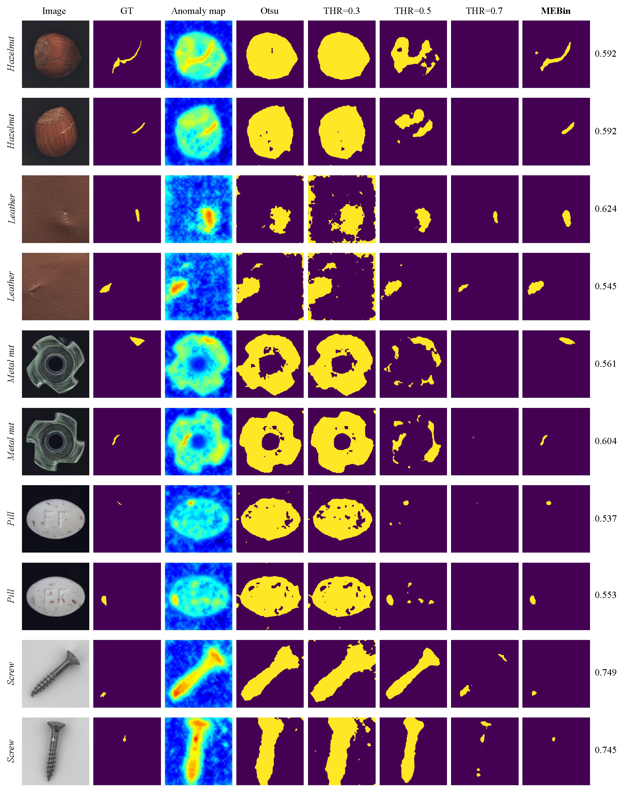
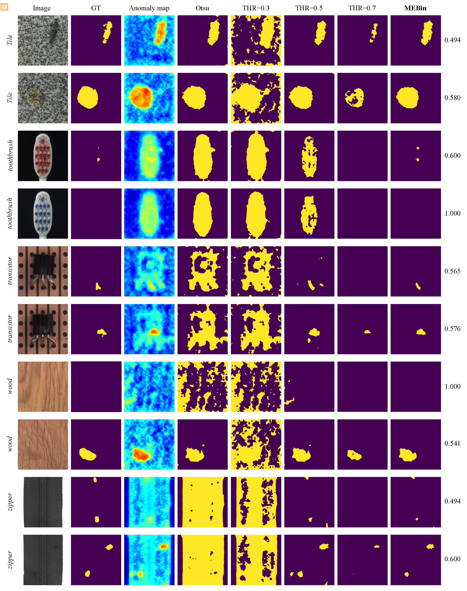

# ✨MEBin✨

**This is an official implementation of the MEBin module in "AnomalyNCD: Towards Novel Anomaly Class Discovery in Industrial Scenarios".**

Authors: [Ziming Huang](https://github.com/ZimingHuang1)<sup>1*</sup> | [Xurui Li](https://github.com/xrli-U)<sup>1*</sup> | [Haotian Liu](https://github.com/xrli-U)<sup>1*</sup> | [Feng Xue](https://xuefeng-cvr.github.io/)<sup>3</sup> | [Yuzhe Wang](https://github.com/YuzheWang888)<sup>1</sup> | [Yu Zhou](https://github.com/zhouyu-hust)<sup>1,2</sup>

Institutions: <sup>1</sup>Huazhong University of Science and Technology | <sup>2</sup>Wuhan JingCe Electronic Group Co.,LTD | <sup>3</sup>University of Trento

### 🧐 [Arxiv](https://arxiv.org/pdf/2410.14379.pdf) | [OpenReview](https://openreview.net/forum?id=PNmlWDgJyH)

## 📣 Update Log:
***09/04/2025***
The complete code for the **MEBin** method, as described in our **AnomalyNCD** [paper](https://arxiv.org/pdf/2410.14379.pdf), is released.


## 📖 Table of Contents

* <a href='#abstract'>1. Abstract</a>
* <a href='#setup'>2. Environment Setup</a>
* <a href='#data preparation'>3. Data preparation</a>
  * <a href='#datasets_mvtec_ad'>MVTec AD</a>
* <a href='#run'>4. Run MEBin</a>
* <a href='#results'>5. Results</a>
* <a href='#citation'>6. Citation</a>
* <a href='#license'>7. License</a>

<span id='abstract'/>

## Abstract: <a href='#all_catelogue'>[Back to Catalogue]</a>

To provide a clear anomaly indication of unlabeled images,
we use an anomaly detection method on $I^\mathbf{u}_i$ to generate the anomaly probability map, denoted as $A_i\in[0,1]^{H \times W}$.
However, $A_i$ inevitably contains false positives (over-detections) and false negatives (missed detections).
These errors can negatively affect multi-class anomaly classification.
To address this, we propose a Main Element Binarization (MEBin) approach.
It extracts the principal anomaly structures (Main Element) from $A_i$ by focusing on stable regions across small threshold variations.
Overall,
the MEBin consists of three steps:
- Predefine a range[<b>S</b><sub>min</sub>, <b>S</b><sub>max</sub>]for threshold exploration;
- Binarize $A_i$ across all thresholds within this range;
- Identify the main elements in $A_i$ based on the changes of segmented regions under different binarization results.

**Binarization Process:**
The MEBin algorithm performs adaptive threshold selection through the following mechanism:
- **Threshold Range Adaptation**: Dynamically determines the search range[<b>S</b><sub>min</sub>, <b>S</b><sub>max</sub>]based on the maximum and minimum anomaly scores across all input images, ensuring the search space covers the actual anomaly score distribution.
- **Stable Interval Detection**: Searches for "stable intervals" where the number of connected components remains constant across consecutive threshold values. A stable interval is defined as a continuous threshold range where the connected component count is invariant and the interval length exceeds the minimum threshold `min_interval_len`.
- **Optimal Threshold Selection**: Selects the threshold corresponding to the longest stable interval, which represents the most robust anomaly structure. If no stable interval is found, it indicates no anomaly regions exist and returns threshold 255.
- **Noise Reduction**: Applies erosion operation to the binarized result to eliminate noise and smooth the change process of abnormal connected components.

**Cropping Process:**
To further enhance the anomaly analysis and prepare data for downstream tasks, we implement an intelligent cropping mechanism:
- **Mask-Based Cropping**: Uses either ground truth masks or binarized anomaly maps as cropping guides to extract regions of interest containing anomalies.
- **Adaptive Crop Box Generation**: Automatically generates crop boxes based on contour detection from masks, with configurable padding ratio to ensure complete anomaly coverage.
- **Smart Box Merging**: Merges nearby crop boxes using distance-based clustering to avoid redundant overlapping regions, with the merging threshold set as 1% of the maximum image dimension.
- **Square Box Adjustment**: Converts merged crop boxes to square format for consistent aspect ratios, prioritizing larger areas for better anomaly representation.
- **Boundary Constraint**: Ensures all crop boxes remain within image boundaries while maintaining minimum size requirements (10% of image size by default).

 

<span id='setup'/>

## Environment Setup: <a href='#all_catelogue'>[Back to Catalogue]</a>

### Environment:

- Python 3.8

Create a virtual environment:

```bash
conda create --name MEBin python=3.8
conda activate MEBin
```

Install dependencies:

```bash
pip install -r requirements.txt
```


## Data preparation: <a href='#all_catelogue'>[Back to Catalogue]</a>
<span id='datasets_mvtec_ad'/>

### [MVTec AD](https://www.mvtec.com/company/research/datasets/mvtec-ad/)

Place the MVTec AD dataset under the ./data folder.

```
data
|-- mvtec_anomaly_detection
|-----|-- bottle
|-----|-----|-- train
|-----|-----|-----|-- good
|-----|-----|-----|-----|-- 000.png
|-----|-----|-----|-----|-- 001.png
|-----|-----|-----|-----|-- ...
|-----|-----|-- test
|-----|-----|-----|-- broken_large
|-----|-----|-----|-----|-- 000.png
|-----|-----|-----|-----|-- 001.png
|-----|-----|-----|-----|-- ...
|-----|-----|-----|-- broken_small
|-----|-----|-----|-- ...
|-----|-- ground_truth
|-----|-----|-----|-- broken_large
|-----|-----|-----|-----|-- 000_mask.png
|-----|-----|-----|-----|-- 001_mask.png
|-----|-----|-----|-----|-- ...
|-----|-----|-----|-- broken_small
|-----|-----|-----|-- ...
|-----|-- cable
|-----|-- ...
```

For anomaly maps，follow the structure below to organize them by different anomaly detection (AD) methods.

```
data
|-- mvtec_ad
|-----|-- ad_method_name
|-----|-----|-- bottle
|-----|-----|-----|-- broken_large
|-----|-----|-----|-----|-- 000.png
|-----|-----|-----|-----|-- 001.png
|-----|-----|-----|-----|-- ...
|-----|-----|-----|-- broken_small
|-----|-----|-----|-- ...
|-----|-----|-- cable
|-----|-----|-- ...
```

<span id='run'/>

## Run MEBin: <a href='#all_catelogue'>[Back to Catalogue]</a>

Before running the code, please configure the parameters defined in the YAML file according to the dataset characteristics. Key parameters are explained below:

```yaml
dataset:
  dataset_name: Name of the dataset for binarization
  dataset_path: Path to the dataset for binarization (required for cropping/evaluating binarization metrics)
  ad_method: Name of the anomaly detection method corresponding to the input anomaly score maps (used to distinguish result save paths)
  anomaly_map_path: Path to the input anomaly score maps

binarization:
  state: Whether to perform binarization (set to True if performing)
  binarization_method: Name of the binarization method  # Options: MEBin, FixedThresholdBin, OtsuBin
  # Parameters for MEBin binarization
  sample_rate: Threshold sampling step size, default is 4 (threshold range 0~255, step size 4, total 64 sampling points).
  min_interval_len: Minimum length of the stable interval, default is 4, can be fine-tuned according to the interval between normal and abnormal score distributions in the anomaly score maps, decrease if there are many false negatives, increase if there are many false positives.
  erode: Whether to perform erosion after binarization to eliminate noise, default is True, this operation can smooth the change process of the number of abnormal connected components.
  # Parameters for fixed threshold binarization
  fixed_threshold: Value of the fixed threshold
  output_path: Path to save binarization results

cropping:
  state: Whether to perform cropping (set to True if performing, and ensure dataset_path in dataset is provided)
  gt_crop: Whether to perform cropping based on ground_truth masks. If you need to use ground_truth to crop, set it to True; if you need to use binarization results to crop, set it to False.
  output_path: Path to save cropping results

evaluation:
  state: Whether to evaluate binarization metrics
  output_path: Path to save evaluation results
```

After configuring the parameters, execute the main program via the command line using the following command:

```bash
python examples/MEBin_main.py
```

### Running Individual Operations

You can also run different operations individually using command line arguments:

**Binarization only:**
```bash
python examples/MEBin_main.py --cropping_state False --evaluation_state False
```

**Cropping only:**
```bash
python examples/MEBin_main.py --state False --evaluation_state False
```

**Evaluation only:**
```bash
python examples/MEBin_main.py --state False --cropping_state False
```


**Binarization and evaluation only:**
```bash
python examples/MEBin_main.py --cropping_state False
```

**Cropping and evaluation only:**
```bash
python examples/MEBin_main.py --state False
```

**Binarization, cropping and evaluation:**
```bash
python examples/MEBin_main.py 
```

<span id='results'/>

## Results: <a href='#all_catelogue'>[Back to Catalogue]</a>
We report the quantitative results on the MVTec AD dataset.
All the results are implemented by the default settings in our paper.

### Results for each anomaly detection method on the MVTec dataset

The following are some quantitative results of binarizing the anomaly maps output by several anomaly detection methods using MEBin.

 

 

The following are some qualitative visualization results of binarizing the anomaly maps output by the anomaly detection method MuSc using MEBin.

 

 

 

<span id='citation'/>

## Citation: <a href='#all_catelogue'>[Back to Catalogue]</a>

If you find this repo useful for your research, please consider citing our paper:

```
@inproceedings{huang2025anomalyncd,
  title={AnomalyNCD: Towards Novel Anomaly Class Discovery in Industrial Scenarios},
  author={Huang, Ziming and Li, Xurui and Liu, Haotian and Xue, Feng and Wang, Yuzhe and Zhou, Yu},
  booktitle={Proceedings of the IEEE/CVF Conference on Computer Vision and Pattern Recognition},
  year={2025}
}
```


<span id='license'/>

## License: <a href='#all_catelogue'>[Back to Catalogue]</a>

MEBin is released under the **MIT Licence**, and is fully open for academic research and also allow free commercial usage. To apply for a commercial license, please contact yuzhou@hust.edu.cn.
